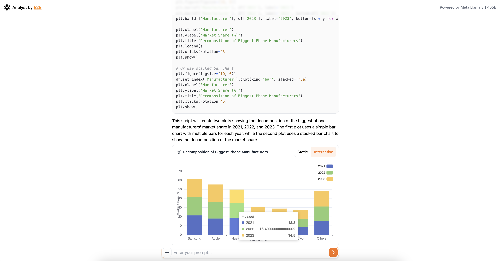

# AI Analyst
This is an AI-powered code and data analysis tool built with Next.js. The default setup now uses [Open WebUI](https://github.com/open-webui/open-webui) with [Ollama](https://ollama.com/) for running models.



→ Try on [Open WebUI](https://github.com/open-webui/open-webui)

## Features
- 🔸 Analyze data with Meta's Llama 3.1
- 🔸 Upload CSV files
- 🔸 Create interactive charts

**Powered by:**
- 🔸 Vercel's AI SDK
- 🔸 Next.js
- 🔸 echarts library for interactive charts

**Supported LLM Providers:**
- 🔸 TogetherAI
- 🔸 Fireworks

**Supported chart types:**
- 🔸 All the supported charts are descriebd [here](https://e2b.dev/docs/code-interpreting/create-charts-visualizations/interactive-charts#supported-intertactive-charts).

**Make sure to give us a star!**


## Get started

Visit the [online version](https://ai-analyst.e2b.dev/) or run locally on your own.

### 1. Clone repository
```
git clone https://github.com/e2b-dev/ai-analyst.git
```

### 2. Install dependencies
```
cd fragments && npm i
```

### 3. Configure Open WebUI
Copy `.example.env` to `.env.local` and fill in variables for Open WebUI and one LLM provider.

Open WebUI: `OPENWEBUI_BASE_URL`

- Example using Docker:
  ```bash
  docker run -d -p 3000:8080 -v open-webui:/app/backend/data --name open-webui --restart always ghcr.io/open-webui/open-webui:ollama
  ```

LLM Providers:
- Fireworks: `FIREWORKS_API_KEY`
- Together AI: `TOGETHER_API_KEY`
- Ollama: `OLLAMA_BASE_URL`
